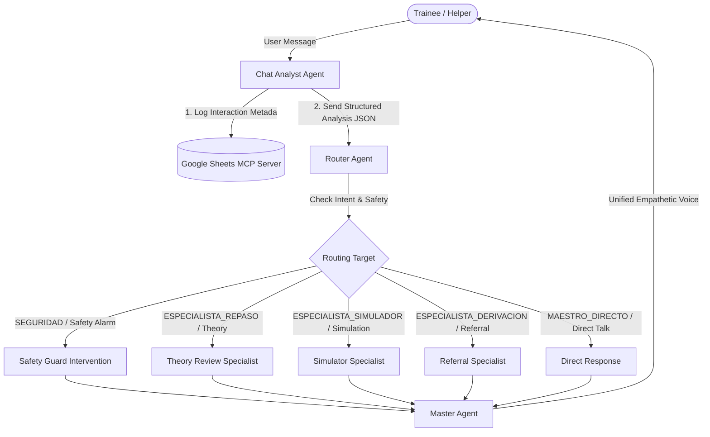

# SoterIA: Bilingual AI Multi-Agent Psychological First Aid (PFA) Training Assistant

🛡️ **SoterIA** (from the Greek *Soteria* - protection/salvation, combined with *IA/AI*) is an advanced bilingual conversational training platform. Built on the **Google Agent Development Kit (ADK)** and powered by **Gemini 2.5**, it trains volunteers, emergency responders, and community members in the protocols of **Psychological First Aid (PFA)** based on WHO and UNICEF standards.

🚀 **Live Deployment on Hugging Face Spaces**: [https://huggingface.co/spaces/claveDeFab/soteria](https://huggingface.co/spaces/claveDeFab/soteria)

---

## 🎯 Target Audience & Purpose / Público Objetivo y Propósito

> [!IMPORTANT]
> ### 👥 ¿Para quién es SoterIA? / Who is SoterIA for?
> 
> * **Este asistente es para ti si / This assistant is for you if:**
>   * Te estás preparando o estás interesado en dar **Primeros Auxilios Psicológicos (PAP)** como voluntario, brigadista, rescatista o miembro de la comunidad. / *You are preparing or are interested in providing **Psychological First Aid (PFA)** as a volunteer, first responder, or community helper.*
>   * Buscas un entorno seguro y simulado para practicar y perfeccionar la aplicación de los protocolos teóricos de contención emocional. / *You want a safe, simulated environment to practice and refine the application of theoretical emotional containment protocols.*
>   * Deseas recibir retroalimentación estructurada basada en los estándares de la OMS y UNICEF sobre tu desempeño en simulaciones. / *You want to receive structured feedback based on WHO and UNICEF standards regarding your performance in simulations.*
>
> * **Este asistente NO es para ti si / This assistant is NOT for you if:**
>   * **❌ Buscas u/o necesitas atención psicológica en vivo, terapia o intervención en crisis en tiempo real.** SoterIA **no** es un agente que proporciona primeros auxilios psicológicos directos a personas afectadas. / *You are looking for or need live psychological care, therapy, or real-time crisis intervention. SoterIA is **not** an agent that provides direct psychological first aid to affected individuals.*
>   * Estás experimentando una emergencia o crisis emocional en este momento. Si es así, por favor busca ayuda profesional de inmediato o llama a la **Línea de la Vida (800 911 2000 en México)** o al **911** / *You are experiencing an emergency or emotional crisis right now. If so, please seek professional help immediately or call your local emergency services or a crisis hotline.*
>   * Crees que una simulación de Inteligencia Artificial puede reemplazar el criterio clínico o la intervención de un profesional de la salud mental certificado. / *You believe that an AI simulation can replace the clinical judgment or intervention of a certified mental health professional.*
>
> * **Contexto geográfico / Geographic Context:**
>   * 🇲🇽 Actualmente, los escenarios de simulación, los directorios de redes de apoyo y las líneas de emergencia integrados en SoterIA están adaptados y enfocados para el **contexto de México** (SAPTEL, Línea de la Vida, etc.). / *Currently, the simulation scenarios, support network directories, and emergency lines integrated into SoterIA are adapted and focused on the **Mexican context** (SAPTEL, Línea de la Vida, etc.).*
>
> ---
>
> ⚠️ **SoterIA es estrictamente un simulador de entrenamiento educativo y no proporciona intervención en crisis a personas reales que estén experimentando una emergencia.** / *SoterIA is strictly an educational training simulator and does not provide crisis intervention to real people experiencing an emergency.*

---

## 📖 Table of Contents
1. [The Problem: A Real Gap, a Dangerous Shortcut](#-the-problem-a-real-gap-a-dangerous-shortcut)
2. [Why Autonomous Agents & Google ADK?](#-why-autonomous-agents--google-adk)
3. [System Architecture & Message Flow](#-system-architecture--message-flow)
4. [Core Features](#-core-features)
5. [Model Context Protocol (MCP) & Data Privacy](#-model-context-protocol-mcp--data-privacy)
6. [Capstone Compliance Matrix](#-capstone-compliance-matrix)
7. [Installation & Local Setup](#-installation--local-setup)
8. [Environment Secrets Configuration](#-environment-secrets-configuration)
9. [References & Standards](#-references-and-standards)

---

## 🚨 The Problem: A Real Gap, a Dangerous Shortcut

Mental health is one of the largest unmet needs on the planet, with more than one billion people living with a mental health condition. In low- and middle-income countries like Mexico, over **two-thirds** of those in need receive no treatment, partly due to a severe shortage of psychiatrists (approx. 0.36 per 10,000 inhabitants, far below the WHO minimum).

When disaster strikes—accidents, earthquakes, violence, or sudden grief—ordinary citizens are the first on the scene. While they want to help, lack of training leads to dangerous shortcuts (like diagnosing patients, making false promises, or performing clinical interventions without credentials). **SoterIA** fills this gap by training helpers in PFA protocols, teaching them how to stabilize, contain, and responsibly refer individuals without crossing critical boundaries.

---

## 🤖 Why Autonomous Agents & Google ADK?

Traditional linear chatbots fail in mental health simulation because they lack control, state validation, and safety barriers. 

By utilizing the **Google Agent Development Kit (ADK)**, SoterIA coordinates a specialized ecosystem of autonomous agents where each has a strict, bounded role:
*   **Encapsulation of Duty**: The *Chat Analyst* only parses, the *Router* only directs, the *Simulator* only roleplays, and the *Master Agent* consolidates the final conversational response.
*   **Prompt Grounding**: By decoupling the simulator from the theory reviewer, we eliminate model hallucination. Theoretical answers are strictly retrieved from the knowledge base.
*   **Invisible Orchestration**: The user only interacts with SoterIA's unified empathetic voice (the Master Agent), while the other agents coordinate invisibly in the background.

---

## 📐 System Architecture & Message Flow

The sequential flow of messages is managed as follows:



### Detailed Agent Descriptions
1.  **Chat Analyst Agent (`analista_chats`)**: Analyzes every incoming message. Detects user intents, PFA steps (ABCDE), and checks for real-user crisis signals. Runs background telemetry logging.
2.  **Router Agent (`enrutador`)**: Receives the output JSON from the Analyst and dynamically chooses the correct specialist path. If a real crisis is detected, it overrides all inputs and routes directly to the Safety flow.
3.  **Theory Review Specialist (`especialista_repaso`)**: Answers questions regarding PFA concepts (such as the ABCDE steps or containment protocols) using strict document retrieval from WHO/UNICEF guidelines.
4.  **Simulator Specialist (`especialista_simulador`)**: Conducts interactive bilingual roleplay, acting as an affected character in a crisis (disasters, accidents, grief, violence).
5.  **Referral Specialist (`especialista_derivacion`)**: Consults a directory of verified professional institutions in Mexico (SAPTEL, Línea de la Vida, IMSS) to provide accurate referral routes.
6.  **Master Agent (`maestro`)**: The final voice. Receives the specialized agent outputs and refines the tone—ensuring it remains professional, warm, and compliant with safety guidelines.

---

## ✨ Core Features

*   **Bilingual Adaptability (ES/EN)**: Detects the language of the user on the fly and replies seamlessly in Spanish, English, or other requested languages.
*   **Active Safety Gate (Real Crisis Barrier)**: Constantly monitors if the user is in personal distress. If triggered, it pauses the training simulation immediately and delivers real-world emergency numbers.
*   **4x4 Interactive Breathing Guide**: A visual, glassmorphic widget designed to guide trainees (or simulated characters) through box breathing (Inhale 4s, Hold 4s, Exhale 4s, Hold 4s) with a smooth dual pulsing aura.
*   **ABCDE Quick Guide Accordion**: A collapsible sidebar panel presenting the PFA protocol stages (Active Listening, Breathing, Categorization, Referral, Psychoeducation).
*   **Trainee Performance Feedback Scorecard**: Generates structured evaluation cards detailing Strengths, Areas of Improvement, and Safety Compliance at the end of each practice.
*   **Multi-User Session Isolation**: Isolates user states and IDs using unique Gradio session variables.

---

## 📊 Model Context Protocol (MCP) & Data Privacy

To log training telemetry for Capstone evaluation and system observability, the Chat Analyst connects to a **Google Sheets MCP Server** via standard stdio parameters.

### 🔒 Privacy Safeguards
To comply with medical, ethical, and privacy standards, **SoterIA never logs PII (Personally Identifiable Information)**, text transcripts, or raw messages. It only appends anonymous metadata:
*   `id_sesion` (Unique session UUID)
*   `marca_temporal` (ISO timestamp)
*   `intencion` (Parsed intent: review, simulation, referral)
*   `tema_pap` (Specific PFA topic queried)
*   `perfil_caso` & `nivel_caso` (Scenario type and difficulty level)
*   `seguridad_activada` (Boolean flag indicating if the Safety Gate was triggered)
*   `satisfaccion` & `comentario` (Anonymous optional closing survey metrics)

---

## 🏆 Capstone Compliance Matrix

SoterIA demonstrates full compliance with all **6 Capstone technical requirements** (exceeding the minimum requirement of 3):

| Rubric Concept | Implementation Location | Description |
| :--- | :--- | :--- |
| **1. Agent / Multi-Agent (ADK)** | `run_soteria.py`, `Agentes/` | Full sequential chain of 6 autonomous agents coordinated using Google ADK. |
| **2. MCP Server** | `analista_chats/agent.py` | Connects to `google-sheets-mcp` via Stdio Connection Params to write logs. |
| **3. Antigravity** | Video Presentation | Demonstrates local testing and deployment workflows using agentic automation. |
| **4. Security Features** | `enrutador/agent.py`, `app.py` | Safety Gate checks for real-crisis signals and prevents harmful system behavior. |
| **5. Deployability** | HF Spaces | Configured with dynamic OAuth 2.0 and Service Account environment variables. |
| **6. Agent Skills (CLI)** | `run_soteria.py` (main) | A fully functional interactive terminal CLI interface for offline practice. |

---

## 💻 Installation & Local Setup

### Prerequisites
*   Python 3.11 or higher
*   Node.js & npm (Required for the Sheets MCP server)
*   Google Sheets API access (Spreadsheet ID: `1o4ERfUvjSYbAhdb_V4tJRp7OIj5b_Tg72fme5LK-JIs`)

### 1. Clone the repository and install Python dependencies
```bash
git clone <repository-url>
cd SoterIA
python -m venv .venv
source .venv/bin/activate  # On Windows: .venv\Scripts\activate
pip install -r requirements.txt
```

### 2. Install the Sheets MCP Server globally
```bash
npm install -g google-sheets-mcp
```

### 3. Setup environment variables
Create a `.env` file in the project root and add your Google API Key:
```env
GOOGLE_API_KEY=AIzaSy...
```
*(Optionally configure Google Sheets API credentials, see section below).*

### 4. Run SoterIA CLI
To interact with the multi-agent system directly in your console:
```bash
python run_soteria.py
```

### 5. Launch Gradio Web App
To run the premium glassmorphism interface locally:
```bash
python app.py
```
Open your browser at `http://127.0.0.1:7860`.

---

## 🔑 Environment Secrets Configuration

SoterIA supports three authentication methods for the Google Sheets telemetry, arranged by priority:

### Method A: Local Service Account JSON File
Define the path to your credentials file:
*   `GOOGLE_APPLICATION_CREDENTIALS` = `"path/to/credentials.json"`

### Method B: Service Account JSON String (Recommended for Hugging Face)
Paste the full JSON content of your service account key file directly into the environment variable:
*   `GOOGLE_SERVICE_ACCOUNT_JSON` = `{"type": "service_account", ...}`

### Method C: Headless OAuth 2.0 (For strict GCP Key policies)
Set up a Desktop Client ID in Google Cloud Console, perform authorization locally, and pass the tokens:
*   `GOOGLE_CLIENT_ID`
*   `GOOGLE_CLIENT_SECRET`
*   `GOOGLE_REFRESH_TOKEN`

---

## 📚 References and Standards
*   **World Health Organization (WHO)**: *Psychological First Aid: Guide for Field Workers* (2011).
*   **UNICEF**: *Guía ABCDE para la aplicación de Primeros Auxilios Psicológicos*.
*   **IASC**: *IASC Guidelines on Mental Health and Psychosocial Support in Emergency Settings* (2007).
